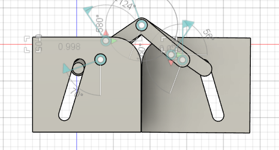

# Final Changes (Nov 6)
After using it for a week, I had almost no negative things to say.

To start off, it worked perfectly as a case, and felt super fun to open and close with the magnets. It also held my reeds very well.

.webp)

The one thing I had an issue with, was the hinge being a bit loose. I tweaked that in the design, making the hole a bit smaller. I printed a couple hinges, finally settling on one that let me slide in the metal wire used as a hinge easily, without having the two sides move around.

The last design change I made, was to switch the circular magnets for cube ones. This is simply because I have plenty of cube magnets I can use, while I used up all my circular magnets for this project. This is just in case I ever make more in the future, either for myself or as a gift. 

.webp)

Here is the CAD file:
[Reed Case](CAD/Reed%20Case.step)

# First Printed Prototypes (Nov 5)
After finishing the CAD, I printed a couple of prototypes to test the case. 

Over the course of 5 prints, I was able to finally tune out the exact widths of the case, the hinge, the slots for the magnet, and the reed holders. 

Many of these changes were very small, less than a millimeter of difference. But by the end of these fixes, the case felt a lot better to use, and worked almost perfectly. 
It was a shame I could not use my hidden hinge design, but the new hinge felt fine to use, and I did not notice it most of the time. 

.jpg)

Now that the small fixes have been made, I use this case for a week, and figure out what I need to change after that. I am quite happy with how this has turned out so far, and I'm quite happy to have a reed cas that fulfills my needs!

# Finished Case Cad (Sept 29)
Over the past couple days, I refined more of the case design. First and foremost, I decided to not use my hidden hinge design. I really wanted this case to appear seamless, but the hinge would have to be less than 2 millimeters thick, which is not doable with most fdm printing.

I quickly designed up a simple hinge, and put both parts togehter.
.webp)

The last notable change was the notches cut into the case, two to allow air to pass through the case(preventing mold), and one to help open the case.
The design was done, and it was time to start printing!

# CAD first part of reed case (Sept 26)
Today, I was able to make part of the reed case. It does not have hinges yet, but the magnets to keep it closed and the actual reed storing method have been finished.

.webp)

I printed the case, and it was able to store reeds. However, I was having some difficulty removing the ones along the edge, so I tweaked the design a bit to add a little extra space for my fingers. Now I just need to figure out how to integrate my hinge into this design. 
I also forgot to add vent holes, so I did that after in the design.

.webp)

# Made a hidden hinge (Sept 23)

Before working on the case for the oboe itself, I wanted to practice my CAD by making a case for my reeds. I wanted a really special design, containing a hidden hinge and magnets to hold it closed. I took inspiration from hidden hinges online:
.webp)
I then spent quite a while figuring out how to make joints, animate them, and be able to have a hinge that works. In the end, I got all the lengths of the joint figured out, but it is not integrated into the case yet.

.webp)
